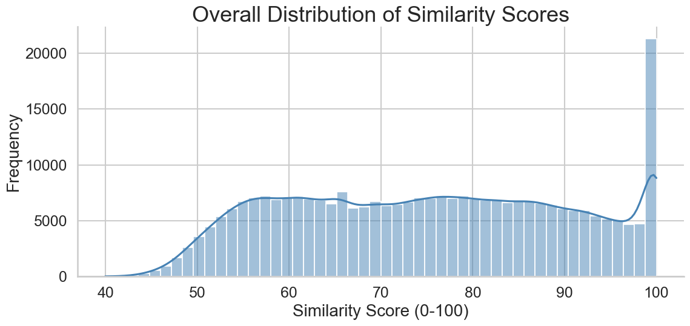
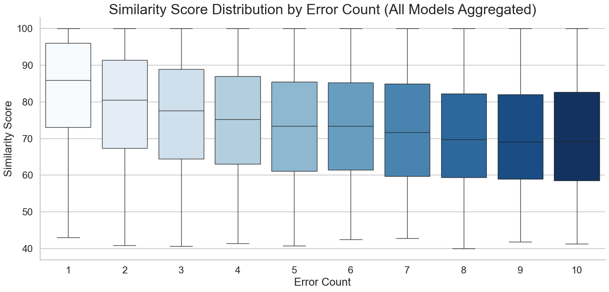
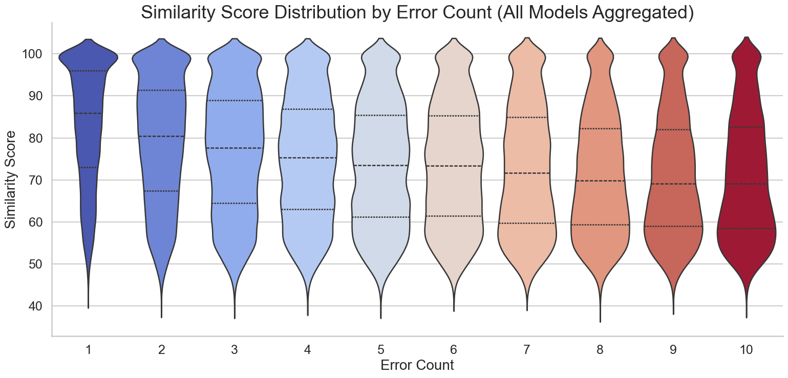
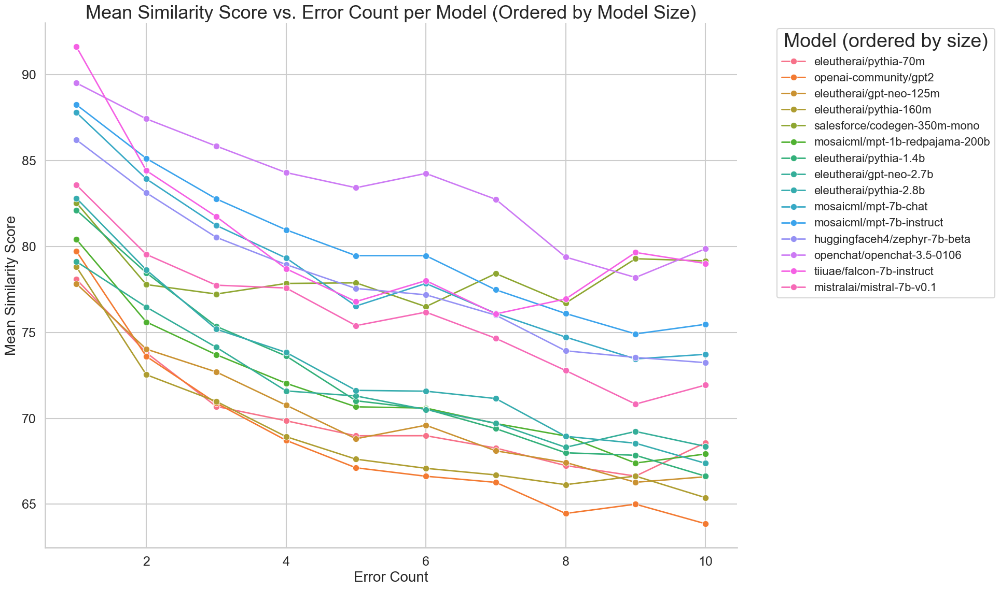
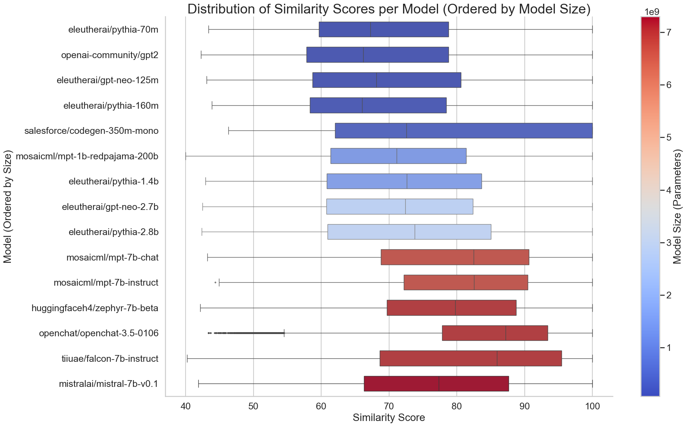
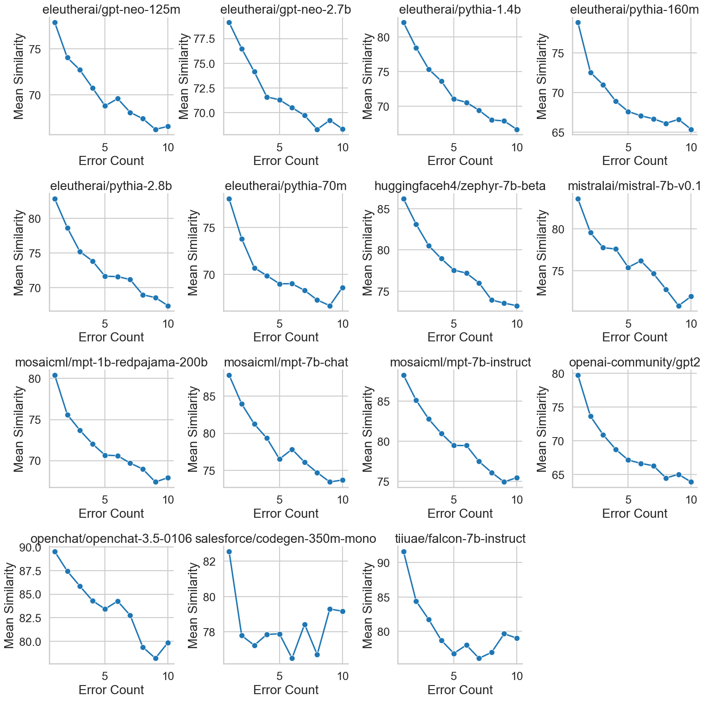
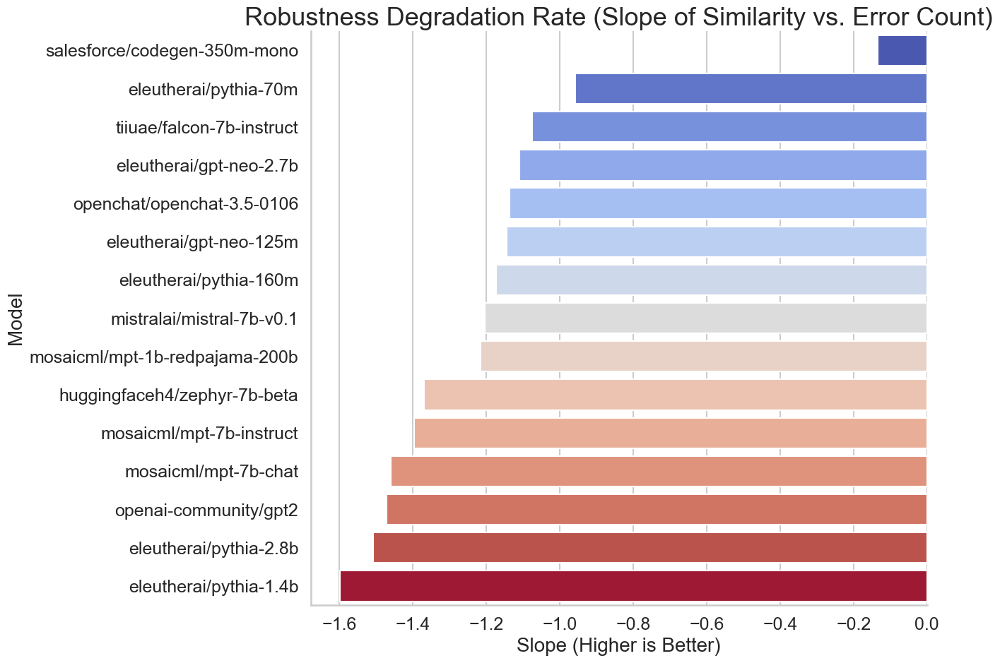
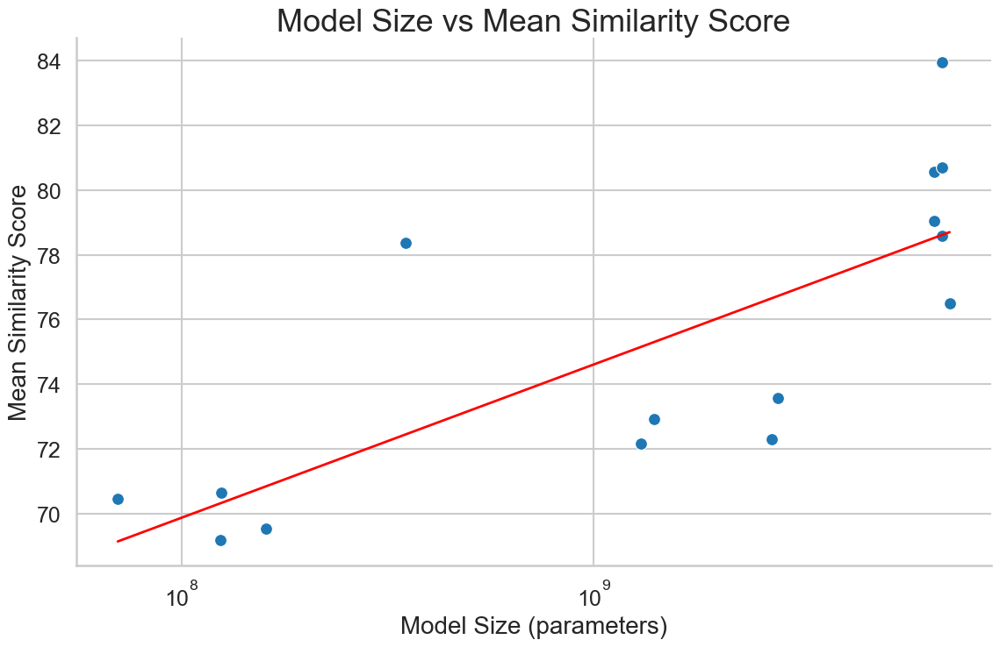
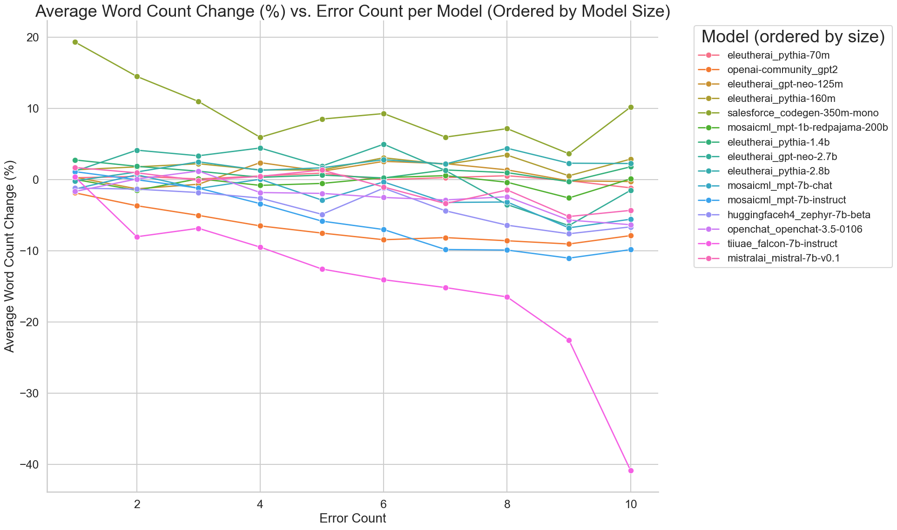

# Robustness Evaluation of Language Models to Controlled Misspellings

## Introduction

This study evaluates the robustness of large language models (LLMs) to syntactic perturbations in the form of controlled misspellings. 

The objective is not to assess the factual correctness or quality of the generated output, but rather to measure how *stable* the output remains when the input is corrupted. Specifically, we quantify how much a model's output changes in response to increasing levels of misspellings by measuring the semantic similarity between outputs generated from clean and corrupted inputs.

## Datasets

### Question Dataset
- Clean sentences (questions) are sampled from the ELI5 (Explain Like I’m Five) corpus.
- These sentences serve as the base for generating corrupted versions.

### Misspelling Dataset
- A dictionary mapping correctly spelled words to common human misspellings.
- Each word is associated with multiple realistic misspelled variants.

### Corrupted Sentence Generation
- For each original sentence, 10 corrupted versions are generated for each predefined number of misspellings (from 1 to 10), resulting in 100 corrupted sentences per original sentence.
- In each corrupted version:
  - A random set of words is selected based on the number of errors to introduce.
  - For each selected word, a misspelled form is randomly chosen from its misspelling variants.
- This process ensures:
  - An exact and controlled number of misspellings per corrupted sentence.
  - Preservation of the overall semantic meaning of the original sentence.
- The controlled corruption enables precise evaluation of model robustness to syntactic noise.

## Methodology

### Error Injection
- Misspellings are systematically introduced by replacing selected words based on a predefined error count (1 to 10).
- The corrupted input maintains the sentence structure and meaning as much as possible, isolating the effect of syntactic errors.
- This method ensures exact ground-truth knowledge of the number of inserted errors per sentence.

### Model Inference
- Fifteen (15) state-of-the-art language models are evaluated, spanning from hundreds of millions to tens of billions of parameters.
- Each model generates outputs for both clean and corrupted input sentences.

### Similarity Computation
- Each clean input sentence is processed by the model to produce a clean output.
- The corresponding corrupted input sentence is processed to produce a corrupted output.
- Outputs are embedded into a latent semantic space using the `all-mpnet-base-v2` model from the SentenceTransformers library.
- Cosine similarity is computed between the embeddings of the clean and corrupted outputs.
- Cosine similarity values are rescaled from [-1, 1] to [0, 100] for better interpretability:

  Similarity Score = (Cosine Similarity + 1) × 50

- Higher similarity scores indicate greater stability and robustness of the model's outputs under syntactic perturbations.
- This evaluation focuses purely on *output consistency* in response to input misspellings and does not assess the factual correctness or quality of the generated text.

### Analysis
- The degradation of similarity scores is analyzed as the number of input misspellings increases.
- For each model, a degradation slope is calculated to quantify robustness loss.
- Correlation analysis is performed between model size (number of parameters) and robustness.

## Models Evaluated

| Model Name |
|------------|
| `Salesforce/codegen-350M-mono` |
| `facebook/opt-1.3b` |
| `EleutherAI/gpt-neo-1.3B` |
| `facebook/opt-2.7b` |
| `EleutherAI/gpt-neo-2.7B` |
| `bigscience/bloom-3b` |
| `EleutherAI/gpt-j-6B` |
| `tiiuae/falcon-7b-instruct` |
| `mosaicml/mpt-7b-instruct` |
| `mosaicml/mpt-7b-chat` |
| `mistralai/Mistral-7B-v0.1` |
| `HuggingFaceH4/zephyr-7b-beta` |
| `openchat/openchat-3.5-0106` |
| `mistralai/Mixtral-8x7B-Instruct-v0.1` |
| `tiiuae/falcon-40b-instruct` |

## Key Results

### Correlation Between Model Size and Robustness

We observe a **Pearson correlation of 0.83** between model size and mean similarity score across models — indicating a strong positive relationship.

**Interpretation**:
- Larger models tend to maintain more stable outputs under input misspellings.
- Parameter scaling not only improves clean data performance but also enhances resilience to syntactic perturbations.

## Visualizations

### Distribution of Similarity Scores (All Models and Errors)

> *Figure 1: Distribution of similarity scores aggregated over all models and all error counts. The plot shows the frequency of similarity values across the entire evaluation set.*

### Distribution of Similarity Scores by Error Count (Boxplot)

> *Figure 2: Boxplot showing the distribution of similarity scores for different numbers of misspellings aggregated over all models.*

### Distribution of Similarity Scores by Error Count (Violin Plot)

> *Figure 3: Violin plot showing the distribution of similarity scores for different numbers of misspellings aggregated over all models.*

### Mean Similarity Score vs. Error Count per Model

> *Figure 4: Mean similarity score vs. error count for each model, with models ordered by size. Each line shows how robustness changes as error count increases.*

### Distribution of Similarity Scores per Model (Ordered by Size)

> *Figure 5: Distribution of similarity scores for each model, ordered by model size. Models are displayed from smallest to largest, showing how performance varies with model capacity.*

### Distribution of Similarity Scores Per Model

> *Figure 6: Distribution of similarity scores for each model. Boxplots are colored according to model size, and a colorbar indicates the parameter scale.*

### Robustness Degradation Rate

> *Figure 7: Degradation slope for each model. Higher slopes indicate slower performance decline under increasing input noise.*

### Model Size vs Mean Similarity Score

> *Figure 8: Scatter plot showing model size (log-scaled) versus mean similarity score. The red line represents the best-fit linear regression. A Pearson correlation of 0.83 indicates a strong positive relationship.*

## Word Count Comparison Analysis

In addition to similarity-based robustness evaluation, we analyze how the output length (measured by word count) changes as a function of the number of misspellings.

For each model and each error level:
- The percentage change in output word count is computed between corrupted and clean outputs.
- The change is normalized by the original word count to allow comparison across sentences of different lengths.

This analysis assesses whether models tend to generate longer or shorter outputs in response to input perturbations and whether model size correlates with stability in output length.

### Word Count Change vs. Error Count

> *Figure 9: Average percentage change in output word count as a function of the number of misspellings for each model. A positive change indicates longer outputs, while a negative change indicates shorter outputs. Larger models show greater stability with smaller deviations in output length.*

## Conclusion

This study demonstrates that larger language models are more robust to syntactic perturbations introduced through controlled misspellings. A strong correlation between model size and output stability suggests that larger models are better suited for deployment in noisy, real-world environments where input quality cannot be guaranteed.

These findings highlight the importance of considering robustness to input noise as a critical factor when selecting language models for production applications.

## Notes

- Future work may extend this analysis to other types of input corruption, such as grammatical errors or code-switching.
- Additional experiments could explore fine-tuning models specifically for robustness to noisy inputs.
